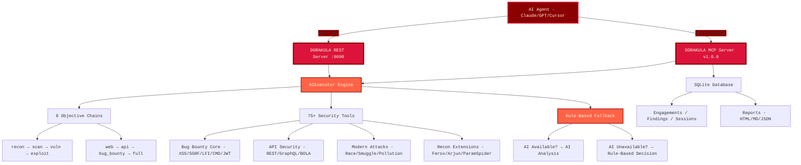

<div align="center">

# DORAKULA v1.0.0
### AI-Powered MCP Bug Bounty Automation Platform

[](https://www.python.org/)
[](LICENSE)
[](https://github.com/0x4m4/dorakula)
[](https://github.com/0x4m4/dorakula)
[](https://github.com/0x4m4/dorakula)
[](https://github.com/0x4m4/dorakula)
[](https://github.com/0x4m4/dorakula)
[](https://github.com/0x4m4/dorakula)

**Advanced AI-powered bug bounty MCP framework with 75+ security tools, 8 autonomous AI agents, and modern attack vector coverage**

[📋 What's New](#whats-new-in-v100) • [🏗️ Architecture](#architecture-overview) • [🚀 Installation](#installation) • [🛠️ Features](#features) • [🤖 AI Agents](#ai-agents) • [📡 API Reference](#api-reference)

</div>

---

## What's New in v1.0.0

DORAKULA is a purpose-built bug bounty automation platform designed by bug bounty hunters, for bug bounty hunters. Unlike general penetration testing tools, DORAKULA focuses specifically on the vulnerabilities that pay: XSS, SSRF, LFI, Command Injection, JWT attacks, API security flaws, race conditions, HTTP smuggling, and more.

**Key Highlights:**
- **75+ Security Tools** covering 7 vulnerability categories
- **8 AI Agents** with autonomous objective-driven execution
- **Rule-Based Fallback** — tools always work even without AI
- **6 DORAKULA-Exclusive Modules** not found in other frameworks
- **MCP Protocol** — native integration with Claude, GPT, Cursor, and any MCP-compatible AI
- **Zero RAM Waste** — Ollama integration with immediate model unloading

---

## Architecture Overview

DORAKULA features a dual-protocol architecture with REST API and MCP server, powered by an AI Executor engine with rule-based fallback guarantees.



### How It Works

1. **AI Agent Connection** — Claude, GPT, Cursor, or any MCP-compatible agent connects via FastMCP or REST API
2. **Objective Planning** — AIExecutor analyzes the target and selects the optimal tool chain from 8 objective types
3. **Autonomous Execution** — AI agents execute comprehensive bug bounty assessments with automatic fallback guarantees
4. **Smart Fallback** — If AI is unavailable, rule-based decision engine takes over seamlessly
5. **Professional Reporting** — Generate HTML/Markdown/JSON reports with CVSS scores and remediation priorities

---

## Installation

### Quick Setup to Run the DORAKULA MCP Server

```bash
# 1. Clone the repository
git clone https://github.com/0x4m4/dorakula.git
cd dorakula

# 2. Create virtual environment
python3 -m venv dorakula-env
source dorakula-env/bin/activate  # Linux/Mac
# dorakula-env\Scripts\activate   # Windows

# 3. Install Python dependencies
pip3 install -r requirements.txt
```

### Install Security Tools

**Core Tools (Essential for Bug Bounty):**
```bash
# Reconnaissance & Scanning
nmap masscan rustscan amass subfinder nuclei httpx

# Web Application Security
gobuster feroxbuster dirsearch ffuf nikto sqlmap wpscan arjun paramspider dalfox

# Password & Authentication
hydra john hashcat
```

**Advanced Tools (For Modern Attack Vectors):**
```bash
# Race Condition & HTTP Smuggling testing
# (Built-in Python modules — no external tools required)

# WebSocket testing
# (Built-in Python websockets library)

# Supply Chain auditing
# (Built-in Python aiohttp — no external tools required)
```

**AI Integration (Optional):**
```bash
# Install Ollama for local AI support
curl -fsSL https://ollama.com/install.sh | sh

# Pull the lightweight model (1.3GB)
ollama pull tinyllama:latest
```

### Start the Server

```bash
# Start the MCP server on default port 9090
python3 dorakula_server.py

# Optional: Start with debug mode
python3 dorakula_server.py --debug

# Optional: Custom port configuration
python3 dorakula_server.py --port 8888

# Optional: Custom API key
python3 dorakula_server.py --api-key your-custom-key

# Optional: Disable MCP (REST API only)
python3 dorakula_server.py --no-mcp
```

### Verify Installation

```bash
# Test server health
curl http://localhost:9090/health

# Test with API key
curl -H "X-Dorakula-API-Key: dorakula-superkey-2026" \
  http://localhost:9090/api/status

# Test AI agent capabilities
curl -X POST http://localhost:9090/api/agent/plan \
  -H "Content-Type: application/json" \
  -H "X-Dorakula-API-Key: dorakula-superkey-2026" \
  -d '{"objective": "bug_bounty", "target": "example.com"}'
```

---

## AI Client Integration Setup

### Claude Desktop Integration

Edit `~/.config/Claude/claude_desktop_config.json`:
```json
{
  "mcpServers": {
    "dorakula": {
      "command": "python3",
      "args": [
        "/path/to/dorakula/dorakula_mcp.py",
        "--server",
        "http://localhost:9090"
      ],
      "description": "DORAKULA v1.0.0 - Offensive Security MCP Platform",
      "timeout": 300,
      "disabled": false
    }
  }
}
```

### VS Code Copilot Integration

Configure VS Code settings in `.vscode/settings.json`:
```json
{
  "servers": {
    "dorakula": {
      "type": "stdio",
      "command": "python3",
      "args": [
        "/path/to/dorakula/dorakula_mcp.py",
        "--server",
        "http://localhost:9090"
      ]
    }
  },
  "inputs": []
}
```

### Cursor Integration

Use the `dorakula-mcp.json` file included in this repository as a template for your MCP server configuration in Cursor settings.

---

## Features

### Security Tools Arsenal

**75+ Professional Security Tools across 7 Categories:**

<details>
<summary><b>🔍 Reconnaissance & Scanning (10+ Tools)</b></summary>

| Tool | Description |
|------|-------------|
| `nmap_scan` | Network port scanning with service detection |
| `nuclei_scan` | Vulnerability scanning with custom templates |
| `subfinder_enum` | Subdomain discovery and enumeration |
| `httpx_probe` | HTTP service probing and technology detection |
| `feroxbuster_scan` | Recursive directory fuzzing |
| `whatweb_scan` | Technology fingerprinting |
| `arjun_params` | Hidden HTTP parameter discovery |
| `paramspider_crawl` | Parameter mining and crawling |
| `testssl_scan` | Deep SSL/TLS analysis |
| `cors_check` | CORS misconfiguration detection |
| `open_redirect_test` | Open redirect vulnerability testing |
| `cookie_security_check` | Cookie security flag analysis |

</details>

<details>
<summary><b>🐛 Bug Bounty Core (15+ Tools)</b></summary>

| Tool | Description |
|------|-------------|
| `xss_scan` | Advanced XSS scanning with Dalfox + AI analysis |
| `xss_payloads` | AI-crafted XSS payload generation |
| `xss_dom_test` | DOM-based XSS detection |
| `xss_blind` | Blind XSS with callback URL |
| `ssrf_test` | SSRF vulnerability testing |
| `ssrf_cloud_metadata` | Cloud metadata endpoint access via SSRF |
| `ssrf_payloads` | AI-crafted SSRF bypass payloads |
| `lfi_test` | Local File Inclusion testing |
| `lfi_wrapper_test` | PHP wrapper exploitation for LFI |
| `lfi_log_poison` | Log poisoning for RCE via LFI |
| `cmd_injection_test` | Command injection vulnerability testing |
| `cmd_blind_test` | Blind command injection detection |
| `jwt_analyze` | JWT token security analysis |
| `jwt_none_bypass` | JWT none algorithm bypass testing |
| `jwt_algorithm_confusion` | JWT RS256→HS256 confusion attack |
| `jwt_crack` | JWT secret brute forcing |
| `jwt_forge` | AI-assisted JWT token forging |

</details>

<details>
<summary><b>🔌 API Security Testing (5+ Tools)</b></summary>

| Tool | Description |
|------|-------------|
| `api_fuzz_rest` | REST API endpoint fuzzing |
| `api_fuzz_graphql` | GraphQL introspection and abuse testing |
| `api_fuzz_openapi` | OpenAPI spec parsing and endpoint fuzzing |
| `api_test_bola` | BOLA/IDOR - Broken Object Level Authorization |
| `api_test_mass_assignment` | Mass assignment vulnerability testing |

</details>

<details>
<summary><b>⚡ Modern Attack Vectors (12+ Tools) — DORAKULA Exclusive</b></summary>

| Tool | Description |
|------|-------------|
| `race_condition_test` | Race condition vulnerability detection |
| `race_coupon_test` | Coupon code reuse via race condition |
| `race_limit_bypass` | Rate limit bypass via race condition |
| `http_smuggle_clte` | CL.TE HTTP request smuggling |
| `http_smuggle_tecl` | TE.CL HTTP request smuggling |
| `http_smuggle_tete` | TE.TE double obfuscation smuggling |
| `http_smuggle_h2c` | H2C upgrade smuggling |
| `http_smuggle_detect_proxy` | Frontend/backend proxy detection |
| `subdomain_takeover_check` | Single subdomain takeover check |
| `subdomain_takeover_scan` | Full subdomain takeover scan |
| `supply_chain_audit_js` | JavaScript vulnerability and secret auditing |
| `supply_chain_audit_cdn` | CDN configuration and security header auditing |
| `supply_chain_check_sri` | Subresource Integrity usage verification |
| `supply_chain_api_keys` | Exposed API key detection in page source |
| `prototype_pollution_test` | Prototype pollution vulnerability testing |
| `prototype_pollution_gadgets` | Known prototype pollution gadget testing |
| `websocket_test_unauth` | WebSocket unauthenticated access testing |
| `websocket_fuzz` | WebSocket message fuzzing |
| `websocket_test_origin` | WebSocket cross-origin policy testing |

</details>

<details>
<summary><b>🌐 Web Application Security (5+ Tools)</b></summary>

| Tool | Description |
|------|-------------|
| `dir_fuzz` | Directory and file fuzzing with Gobuster/FFuF |
| `nikto_scan` | Web server security assessment |
| `sqlmap_scan` | SQL injection detection and exploitation |
| `hydra_brute` | Password brute forcing |
| `web_full_scan` | Comprehensive web application assessment |

</details>

<details>
<summary><b>📊 Infrastructure & Reporting (6+ Tools)</b></summary>

| Tool | Description |
|------|-------------|
| `db_stats` | Database statistics and metrics |
| `db_list_engagements` | List all bug bounty engagements |
| `report_generate_html` | Professional HTML report generation |
| `report_generate_markdown` | Markdown report generation |
| `session_create` | Create testing sessions with scope |
| `session_list` | List and manage testing sessions |

</details>

### AI Agents

**8 Specialized AI Objective Chains:**

| Agent | Objective | Tool Chain |
|-------|-----------|------------|
| **Recon Agent** | `recon` | subfinder → httpx → nmap → whatweb |
| **Scan Agent** | `scan` | nmap → nuclei → feroxbuster → testssl |
| **Vulnerability Agent** | `vuln` | xss → ssrf → lfi → cmdi → jwt |
| **Exploit Agent** | `exploit` | sqlmap → hydra → race → smuggle |
| **Full Assessment** | `full` | recon → scan → vuln → exploit chain |
| **Web Agent** | `web` | nikto → dirfuzz → sqlmap → cors → cookies |
| **API Agent** | `api` | rest_fuzz → graphql → bola → mass_assign |
| **Bug Bounty Agent** | `bug_bounty` | Full bug bounty workflow automation |

### Advanced Features

- **Smart Caching** — Avoid redundant scans with intelligent result caching
- **Rule-Based Fallback** — All tools work even when AI is unavailable
- **Zero RAM Waste** — Ollama models unload immediately after inference
- **HMAC-SHA256 Auth** — Secure API key authentication on all endpoints
- **Scope Guard** — Automatic target validation against engagement scope
- **Sandbox Execution** — Dangerous command patterns blocked by default
- **Session Management** — Full testing session tracking with phase transitions
- **Professional Reports** — HTML/Markdown/JSON reports with CVSS scores and priority matrices
- **SQLite Database** — Persistent storage for engagements, findings, and scan results
- **Cloudflare Tunnel** — Remote access via Cloudflare tunnel support

---

## API Reference

### Core System Endpoints

| Endpoint | Method | Description |
|----------|--------|-------------|
| `/health` | GET | Server health check |
| `/api/status` | GET | Server status and statistics |
| `/api/agent/tools` | GET | List available AI agent tools |
| `/api/agent/plan` | POST | Plan a tool chain for an objective |
| `/api/agent/execute` | POST | Execute an AI agent task |
| `/api/agent/tasks` | GET | List all agent tasks |
| `/api/agent/task/<id>` | GET | Get task details by ID |
| `/api/agent/log` | GET | Agent execution log |

### Reconnaissance Endpoints

| Endpoint | Method | Description |
|----------|--------|-------------|
| `/api/recon/nmap` | POST | Nmap port scanning |
| `/api/recon/nuclei` | POST | Nuclei vulnerability scanning |
| `/api/recon/subfinder` | POST | Subdomain enumeration |
| `/api/recon/httpx` | POST | HTTP service probing |

### Web Application Endpoints

| Endpoint | Method | Description |
|----------|--------|-------------|
| `/api/web/dirfuzz` | POST | Directory fuzzing |
| `/api/web/nikto` | POST | Nikto web scanner |
| `/api/web/sqlmap` | POST | SQL injection testing |

### Bug Bounty Endpoints

| Endpoint | Method | Description |
|----------|--------|-------------|
| `/api/xss/scan` | POST | XSS vulnerability scanning |
| `/api/ssrf/test` | POST | SSRF vulnerability testing |
| `/api/lfi/test` | POST | LFI vulnerability testing |
| `/api/cmdi/test` | POST | Command injection testing |
| `/api/jwt/analyze` | POST | JWT token analysis |
| `/api/api-fuzz/rest` | POST | REST API fuzzing |
| `/api/api-fuzz/graphql` | POST | GraphQL testing |

### Advanced Attack Endpoints

| Endpoint | Method | Description |
|----------|--------|-------------|
| `/api/race-condition/test` | POST | Race condition testing |
| `/api/smuggling/test` | POST | HTTP request smuggling |
| `/api/subdomain-takeover/scan` | POST | Subdomain takeover check |
| `/api/supply-chain/audit` | POST | Supply chain security audit |
| `/api/prototype-pollution/test` | POST | Prototype pollution test |
| `/api/websocket/test` | POST | WebSocket security test |

### Infrastructure Endpoints

| Endpoint | Method | Description |
|----------|--------|-------------|
| `/api/db/stats` | GET | Database statistics |
| `/api/reports/generate` | POST | Report generation (html/md/json) |
| `/api/sessions/create` | POST | Create testing session |

---

## Usage Examples

### Running a Full Bug Bounty Assessment

Simply tell your AI agent (Claude, GPT, Cursor) what you want to test:

```
You: I found a target app.example.com for a bug bounty program.
Run a full bug bounty assessment focusing on XSS, SSRF, and API vulnerabilities.

AI Agent: I'll run a comprehensive bug bounty assessment on app.example.com.
Let me plan the attack chain first...

[Calls: /api/agent/plan with objective "bug_bounty" and target "app.example.com"]

Executing recon phase...
[Calls: subfinder_enum → httpx_probe → nmap_scan → whatweb_scan]

Executing vulnerability scan phase...
[Calls: xss_scan → ssrf_test → lfi_test → api_fuzz_rest → api_fuzz_graphql]

Found 3 Critical, 7 High, 12 Medium vulnerabilities.
[Calls: report_generate_html → session_create]
```

### Manual API Usage

```bash
# XSS Scan
curl -X POST http://localhost:9090/api/xss/scan \
  -H "Content-Type: application/json" \
  -H "X-Dorakula-API-Key: dorakula-superkey-2026" \
  -d '{"target": "https://app.example.com", "depth": 3}'

# SSRF Test
curl -X POST http://localhost:9090/api/ssrf/test \
  -H "Content-Type: application/json" \
  -H "X-Dorakula-API-Key: dorakula-superkey-2026" \
  -d '{"target": "https://app.example.com/api/fetch", "parameters": "url,redirect,page"}'

# JWT Analysis
curl -X POST http://localhost:9090/api/jwt/analyze \
  -H "Content-Type: application/json" \
  -H "X-Dorakula-API-Key: dorakula-superkey-2026" \
  -d '{"token": "eyJhbGciOiJIUzI1NiIs..."}'

# Race Condition Test
curl -X POST http://localhost:9090/api/race-condition/test \
  -H "Content-Type: application/json" \
  -H "X-Dorakula-API-Key: dorakula-superkey-2026" \
  -d '{"target": "https://app.example.com", "endpoint": "/api/apply-coupon", "concurrency": 50}'

# Generate Report
curl -X POST http://localhost:9090/api/reports/generate \
  -H "Content-Type: application/json" \
  -H "X-Dorakula-API-Key: dorakula-superkey-2026" \
  -d '{"engagement_id": "dk-20260531-001", "format": "html"}'
```

### Performance Comparison

| Metric | Traditional Manual | With DORAKULA AI |
|--------|--------------------|-------------------|
| Full recon scope | 4-6 hours | 15-30 minutes |
| XSS testing | 2-3 hours | 5-10 minutes |
| API fuzzing | 3-5 hours | 10-20 minutes |
| Report generation | 1-2 hours | Instant |
| Race condition testing | Manual only | Automated |

---

## Troubleshooting

### Common Issues

**Port already in use:**
```bash
# Check what's using the port
lsof -i :9090
# Kill the process
kill -9 <PID>
# Or use a different port
python3 dorakula_server.py --port 8888
```

**Ollama not responding:**
```bash
# Start Ollama service
ollama serve
# Pull the model
ollama pull tinyllama:latest
# DORAKULA will use rule-based fallback if AI is unavailable
```

**Permission denied on security tools:**
```bash
# Some tools require root (e.g., nmap SYN scan)
sudo python3 dorakula_server.py --debug
```

### Debug Mode

```bash
# Start with verbose debug logging
python3 dorakula_server.py --debug

# Check server logs
tail -f /tmp/dorakula_audit.log
```

---

## Security Considerations

<div align="center">

**⚠️ WARNING: This tool is designed for AUTHORIZED security testing only. ⚠️**

</div>

**Legal and Ethical Use:**
- ✅ Bug bounty programs with explicit authorization
- ✅ Penetration testing with signed scope agreements
- ✅ Security research on systems you own
- ✅ CTF competitions and educational purposes
- ✅ Vulnerability disclosure programs

**Forbidden:**
- ❌ Testing systems without explicit permission
- ❌ Exploiting vulnerabilities for personal gain
- ❌ Using this tool for illegal activities
- ❌ Unauthorized access to third-party systems

---

## Project Structure

```
dorakula/
├── dorakula_server.py          # Main server (REST + MCP)
├── dorakula_mcp.py             # MCP bridge for AI clients
├── dorakula_extended_tools.py  # Extended tools integration layer
├── dorakula-mcp.json           # MCP client config template
├── requirements.txt            # Python dependencies
├── .env.example                # Environment configuration template
├── .gitignore                  # Git ignore rules
├── LICENSE                     # MIT License
├── README.md                   # This file
├── agents/                     # Bug bounty agent modules
│   ├── xss_scanner.py          # XSS vulnerability scanning
│   ├── ssrf_tester.py          # SSRF vulnerability testing
│   ├── lfi_tester.py           # LFI vulnerability testing
│   ├── cmd_injection.py        # Command injection testing
│   ├── jwt_analyzer.py         # JWT security analysis
│   └── api_fuzzer.py           # API security fuzzing
├── advanced/                   # Modern attack vector modules
│   ├── race_condition.py       # Race condition detection
│   ├── http_smuggling.py       # HTTP request smuggling
│   ├── subdomain_takeover.py   # Subdomain takeover detection
│   ├── supply_chain_auditor.py # Supply chain auditing
│   ├── prototype_pollution.py  # Prototype pollution testing
│   └── websocket_tester.py     # WebSocket security testing
├── core/                       # Core infrastructure modules
│   ├── database.py             # SQLite database management
│   ├── session_manager.py      # Testing session management
│   └── report_generator.py     # Professional report generation
├── assets/                     # Images and documentation assets
├── data/                       # Database storage (gitignored)
└── reports/                    # Generated reports (gitignored)
```

---

## Contributing

Contributions are welcome! Areas of priority:

1. 🐛 **New Bug Bounty Modules** — IDOR, Business Logic, 2FA bypass
2. 🤖 **AI Agent Improvements** — Better objective planning and chain execution
3. 🔌 **MCP Tool Expansion** — More tools for emerging vulnerability classes
4. 📊 **Reporting Enhancements** — PDF export, dashboard visualization
5. 🐳 **Docker Support** — Containerized deployment

---

## License

MIT License - see [LICENSE](LICENSE) file for details.

---

## Author

**0x4m4** — [GitHub](https://github.com/0x4m4) | [HexStrike](https://github.com/0x4m4/hexstrike-ai)

---

<div align="center">

**If DORAKULA helps you find bugs, give it a ⭐!**

[](https://star-history.com/#0x4m4/dorakula&Date)

</div>
